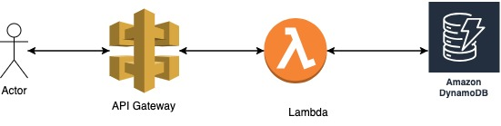

# Redirect API with Serverless 

This project is a simple redirect API with serverless framework. This API will be deployed on AWS + Serverless + DynamoDB. 

## Diagram

### Architecture Flow
Serverless uses AWS Lambda and API Gateway. DynamoDB is used as a database.


### Lamda Function Flow


## Prerequisites
- [Serverless](https://www.serverless.com/ )
- [AWS CLI](https://docs.aws.amazon.com/cli/latest/userguide/getting-started-install.html)

## Usage
Deploy your application with serverless deploy.
```bash
serverless deploy
```

## Endpoints

`POST: /generateShortUrl`
```bash
curl -X POST 'https://xxxxxxxxx.execute-api.us-east-1.amazonaws.com/generate-short-url' \
--header 'Content-Type: application/json' \
--data '{"originalUrl": "https://www.goodreads.com/"}'
```
Response:
```
{"shortUrl": "https://xxxxxxxxx.execute-api.us-east-1.amazonaws.com/dubqe"}
```


`POST: /getOriginalUrl`
```bash
curl -X GET 'https://xxxxxxxxx.execute-api.us-east-1.amazonaws.com/get-original-url?shortUrl=https://xxxxxxxxx.execute-api.us-east-1.amazonaws.com/dubqe'
```
Response:
```
{"originalUrl": "https://www.goodreads.com/"}
```


`GET: /{shortUrl}` - Redirect
```bash
curl -X GET 'https://xxxxxxxxx.execute-api.us-east-1.amazonaws.com/dubqe'
```
Response:
```
Code: 302
Redirect to https://www.goodreads.com/
```


## TODO
- Add delete endpoint
- Add update endpoint
- Add click counter
